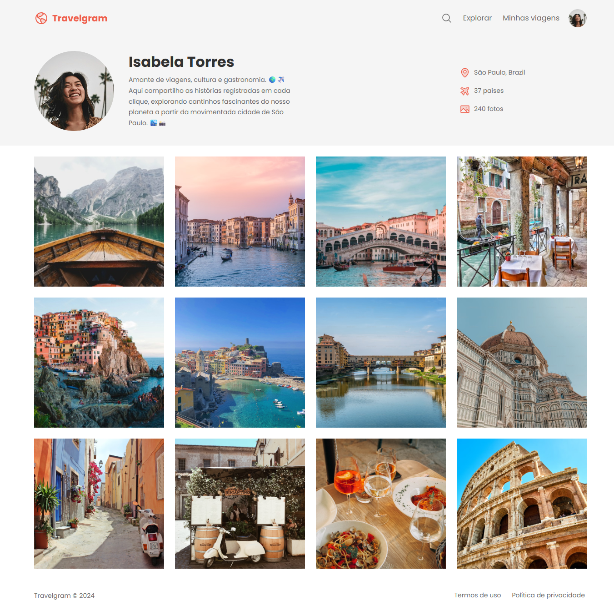

# Página de Perfil Travelgram

Este é um projeto de uma página de perfil de usuário voltada para viagens, desenvolvido com **HTML** e **CSS**. A interface exibe uma galeria de fotos, informações do perfil e menus de navegação, simulando uma rede social de viajantes. O design da página utiliza fontes personalizadas do Google Fonts.

## Tecnologias Utilizadas

* **HTML5**: Estruturação do conteúdo da página.
* **CSS3**: Estilização modular usando arquivos separados por seção.
* **Google Fonts**: Fonte "Poppins" para melhor visual.

## Estrutura do Projeto

O projeto está organizado da seguinte forma:

* `index.html`: Estrutura principal da página.
* `styles/index.css`: Arquivo principal que importa todos os estilos.
* `styles/global.css`: Reset de estilos e variáveis globais CSS.
* `styles/nav.css`: Estilo da barra de navegação.
* `styles/header.css`: Estilo do cabeçalho com informações do perfil.
* `styles/main.css`: Estilo da galeria de imagens.
* `styles/footer.css`: Estilo do rodapé.
* `assets/`: Imagens da galeria, ícones, foto de perfil e logotipo, além da captura de tela da página.

## Como Visualizar o Projeto

1. Clone este repositório:

   ```bash
   git clone https://github.com/Dandiels/projeto-travelgram.git
   ```
2. Abra o arquivo `index.html` em um navegador web.

## Funcionalidades

* Menu de navegação com links (sem redirecionamento) e ícones SVG.
* Perfil com foto, nome, biografia e estatísticas de viagem.
* Galeria com 12 imagens de lugares visitados.
* Rodapé com informações legais fictícias.

## Captura de Tela


## Créditos
Projeto inspirado e desenvolvido com referência aos materiais da **Rocketseat**.